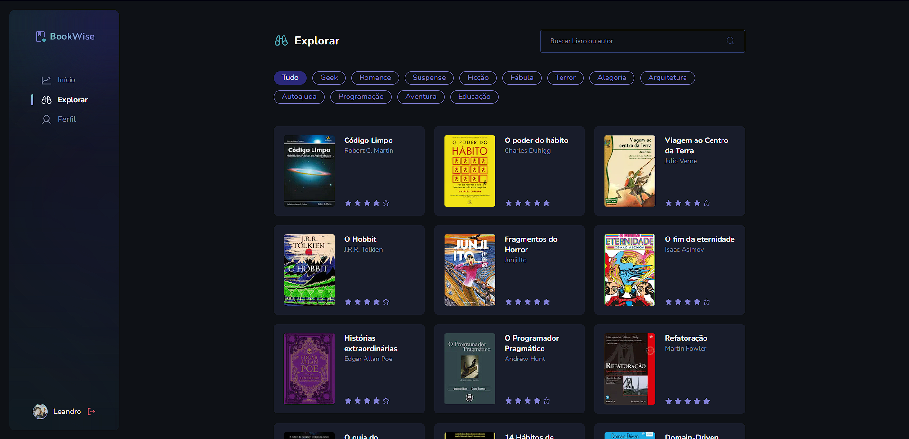

# Book Wise - Share your book reviews 📚

<br>

<p align="center">
  <a href="#-about-the-project">About the project</a> •
  <a href="#-technologies">Technologies</a> •
  <a href="#-getting-started">Getting started</a> •
  <a href="#-license">License</a>
</p>

<p align="center">
 
 
  
</p>

## 👩‍💻 About the project

BookWise is an innovative website that provides an interactive platform for book lovers. Users can explore a vast collection of literary works and share their opinions in a detailed manner, rating each book on a scale from 0 to 5 and accompanying it with a written description. The website also offers a personalized profile for each user, where it is possible to access all the ratings made, as well as view the list of books read. Additionally, users have the opportunity to explore the public profiles of other community members, allowing for an enriching exchange of literary recommendations and reviews.

[click here, see closer](https://book-wise-cs.vercel.app/explore) 😉

**Note:** The application database is running on Railway, where the free plan has a monthly usage limit.

## 🔖 Layout

You can view the project layout through the links below:

- [Layout in Figma](<https://www.figma.com/file/mUPpYFQ34dfLLBFp81z7Ec/BookWise-(Copy)?type=design&node-id=1-17&mode=design>)

> Remembering that you need to have a [Figma](http://figma.com/) account to access it.

## 🚀 Technologies

- [DayJs](https://day.js.org/)
- [Next-auth](https://next-auth.js.org/) (Sign in with Google or Github account)
- [NextJs](https://nextjs.org/)(AppDir)
- [Postgresql](https://www.postgresql.org/)
- [Prisma](https://www.prisma.io/)
- [Radix UI](https://www.radix-ui.com/)
- [Tailwind Css](https://tailwindcss.com/)
- [Zod](https://github.com/colinhacks/zod)

## 💻 Getting started

### Requirements

- [Node.js](https://nodejs.org/en/)
- [Yarn](https://classic.yarnpkg.com/) or [NPM](https://www.npmjs.com/) _(examples are with NPM)_
- [Postgresql](https://www.postgresql.org/) or [Docker](https://hub.docker.com/_/postgres) container with a postgres server instance

**Clone the project and access the folder**

```bash
$ git clone https://github.com/leandrorodrigues00/book-wise && cd book-wise

```

**Follow the steps below**

```bash
# Install the dependencies
$ npm i

# Make a copy of '.env.example' to '.env'
# and set with YOUR environment variables.
$ cp .env.example .env

# Start the database
docker run --name postgresql -e POSTGRES_PASSWORD=docker -p 5432:5432 -d postgres:latest

# Start the app
$ npm run dev
```

## 📝 License

This project is licensed under the MIT License - see the [LICENSE](LICENSE) file for details.

---

<p align="center">
  Made with 💜&nbsp; by  Leandro Rodrigues
</p>
